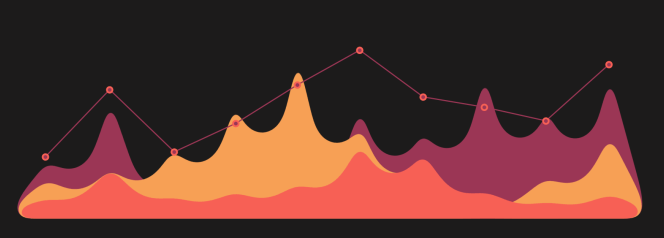

<!--
<h2 align="center">
  Welcome to corbeau217 World!
  
</h2>
-->

<table align="center">
  <tr align="center">
    <td>
      
    </td>
  </tr>
  <tr>
    <td>
      <table>
        <tr>
          <td width="40%">
            
          </td>
          <td width="20%">
          </td>
          <td width="40%">
            
          </td>
        </tr>
      </table>
    </td>
  </tr>
  <tr>
    <td>
      
    </td>
  </tr>
  <tr>
    <td>
      <table width="100%" align="center">
        <tr>
          <td width="70%" align="center">
            <samp>
              <!-- <a href="https://www.google.com/search?q=Aurora+Griffith">「 Google Me 」</a> -->
               
              Software Engineering student in <b>Sydney AUS</b>
               
               
              They / Them
               
               
              
              
            </samp>
          </td>
          <td width="20%">
            
          </td>
        </tr>
      </table>
    </td>
  </tr>
  <tr align="center">
    <td>
      <ul>
        <li>"<em>Do, or do not. There is no try</em>" has been echoing in my head</li>
        <li>learning about computer science, programming, and electronics</li>
        <li>Ask me about anything <a href="https://github.com/corbeau217/corbeau217/issues">here</a></li>
      </ul>
    </td>
  </tr>
  <tr align="center">
    <td>
      
    </td>
  </tr>
  <tr align="center">
    <td>
      <samp>
        
        
        
        
        
        
        
      </samp>
    </td>
  </tr>
  <tr align="center">
    <td>
      <samp>
        
        
        
        
        
        
        
        
        
        
        
        
        
        
        
        
        
        
        
        
        
        
        
      </samp>
    </td>
  </tr>
  <tr>
    <td>
      <table align="center">
        <tr align="center">
          <td width="40%">
            <table align="center">
              <tr align="center">
                <td>
                  
                </td>
              </tr>
              <tr align="center">
                <td>
                  
                </td>
              </tr>
              <tr align="center">
                <td>
                  
                </td>
              </tr>
            </table>
          </td>
          <td width="40%">
            
          </td>
        </tr>
      </table>
    </td>
  </tr>
  <tr align="center">
    <td align="center">
      <table align="center">
        <tr align="center">
          <td align="center">
            
          </td>
          <td align="center">
            
          </td>
        </tr>
      </table>
    </td>
  </tr>
  <tr>
    <td align=center>
      
    </td>
  </tr>
</table>

<!-- ---------------------------- -->

 

<h2>My stats</h2>

<table width="100%" align="center">
  <tr align="center">
    <td align="center">
      
    </td>
  </tr>
  <tr align="center">
    <td>
      
    </td>
  </tr>
  <tr align="center">
    <td>
      <table width="100%" align="center">
        <tr align="center">
          <td width="49.5%">
            
          </td>
          <td width="49.5%">
            
          </td>
        </tr>
      </table>
    </td>
  </tr>
</table>

<!-- ---------------------------- -->
 
 

  

 
 

<h2>Readme theme data</h2>

<h3 align="center">Colour palette</h3>

  <!-- used colours -->
  
  
  
  
   
  

    
<i>show / hide all</i>

    <!-- oranges -->
    
    
    
    
    
    
    
    
    
    
    
     
    <!-- greys -->
    
    
    
    
    
    
    
    
    
     
    <!-- redss -->
    
    
    
    
    
    
    
    
     
    <!-- blues -->
    
    
    
    
    
    
    
    
    
    
    
    
    
    
    
    <!-- this one is colour dropper from screenshot of the wakatime since we cant change it -->
  

   

<!-- ---------------------------- -->
